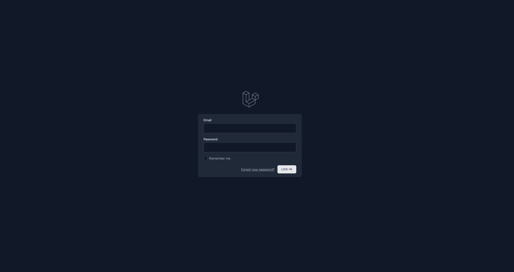
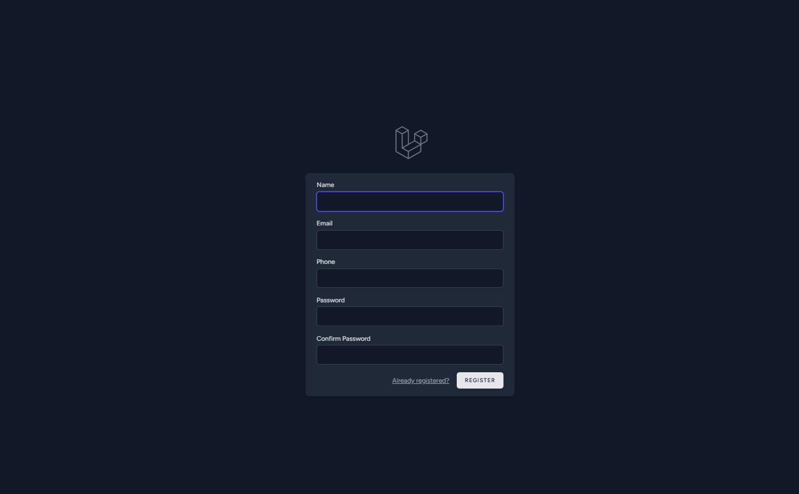
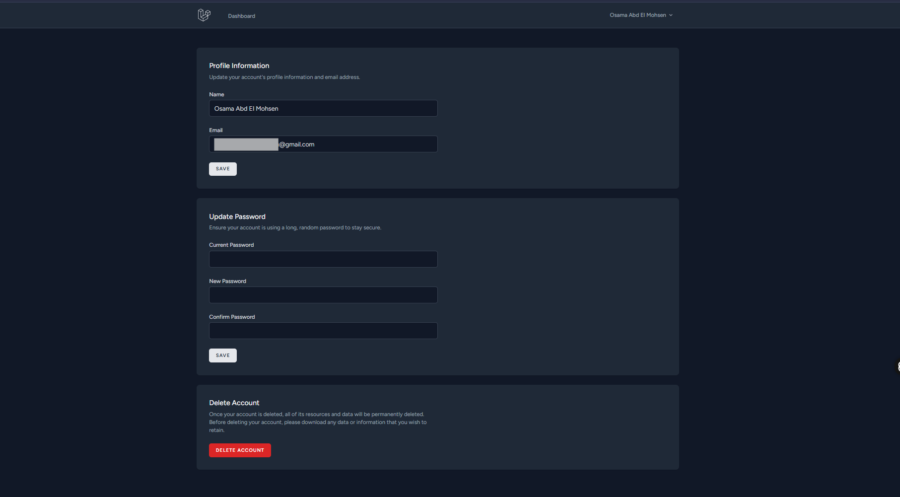
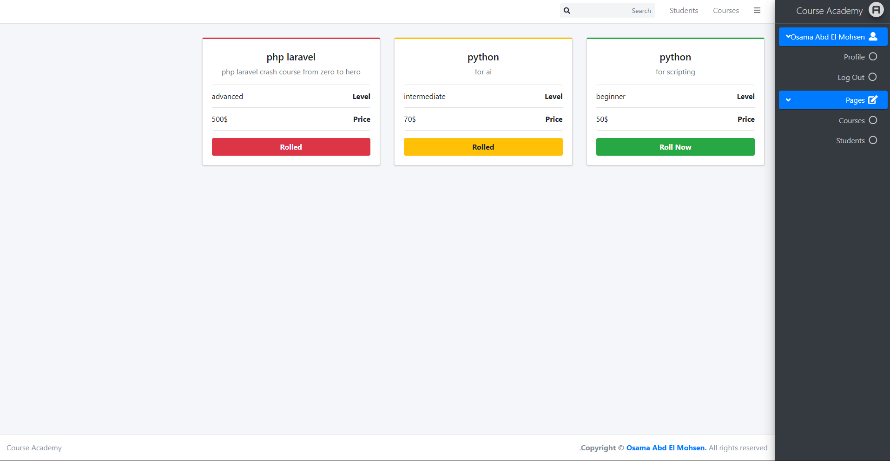
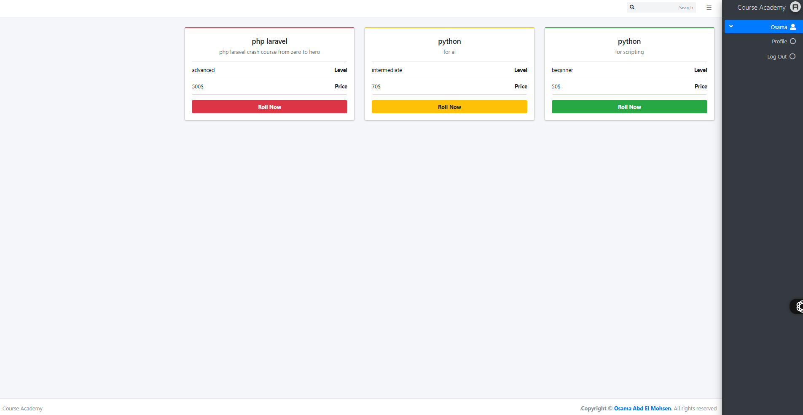
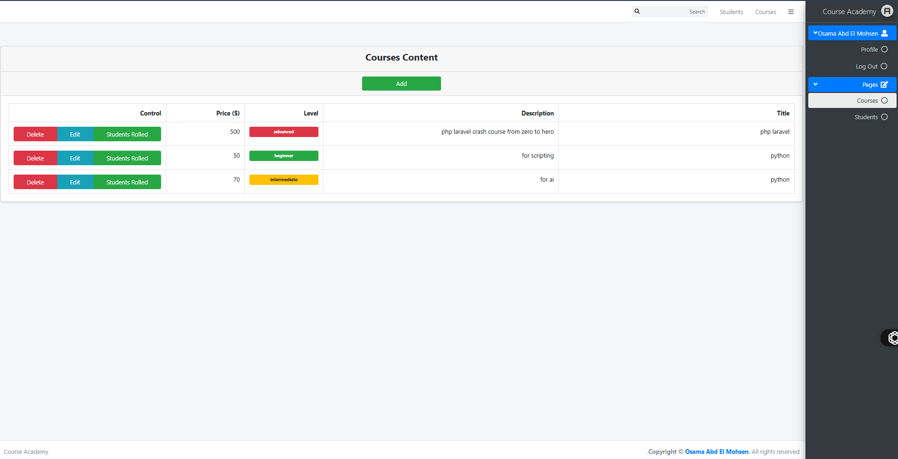
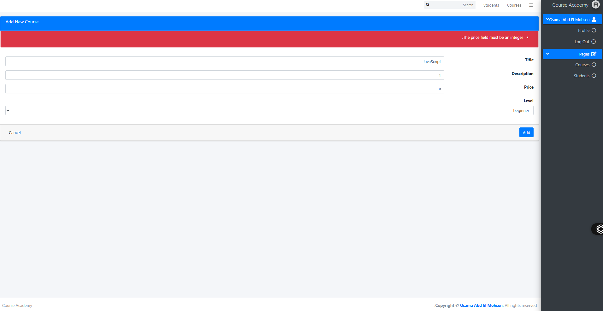
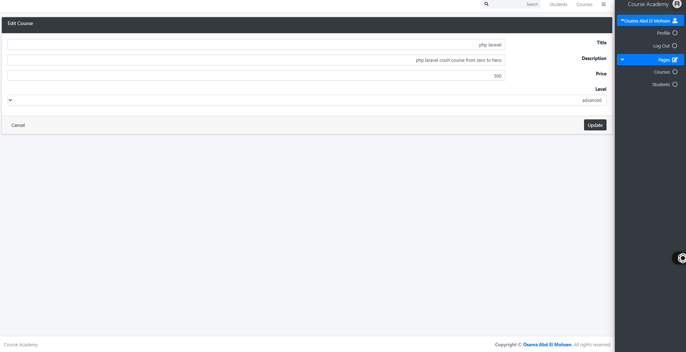
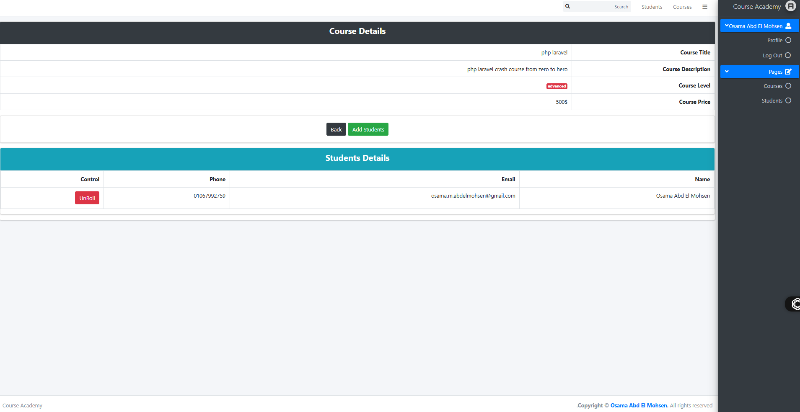
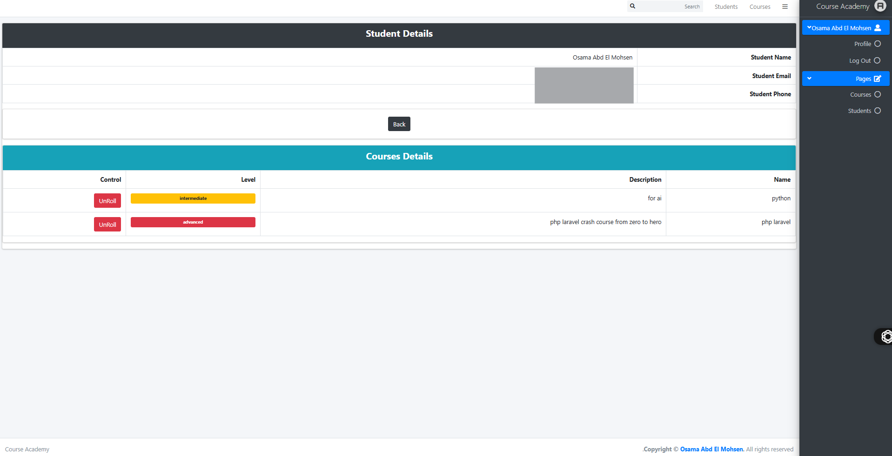

# Course Academy

**Course Academy** is a Laravel-based platform for managing courses and students. It allows you to add, edit, and delete courses, and enroll students in different courses through a simple and robust admin dashboard.

---

## 🚀 Main Features

- Add, update, or delete courses (with title, description, level, and price).
- Manage students and assign them to courses (enroll/unenroll).
- Course classification by level (beginner, intermediate, advanced).
- Modern user interface using [AdminLTE](https://adminlte.io/) and Bootstrap.
- Error and success messages for main operations.
- Clean code structure leveraging Laravel MVC.
- Many-to-many relationship between courses and students.

---
## 💻 Pics
| Picture Name | Picture |
|--------------|---------|
| Login   |  |
| Register   |  |
| Edit Profile   |  |
| Home [Admin]   |  |
| Home [Guest]  |  |
| Cousrses  |  |
| Add Course  |  |
| Edit Course  |  |
| Course's Students  |  |
| Student's Courses   |  |

---
## ✨ Latest Major Update (2025-09-19)

**Commit:**  
[`adding Breeze Auth and customise it to suite the project`](https://github.com/Osama-Abd-El-Mohsen/Course-Academy/commit/687f27205e95af00e93880c7b790944fa083e4da)

### What's New

- **Authentication System:**  
  Integrated Laravel Breeze for authentication, and customized it for the project’s needs.
  - Added all Auth controllers for registration, login, password reset, and email verification.
  - Added request validation for authentication.
  - Added components for layouts.

- **User Management Refactor:**  
  - Removed the old `Student` model and controller.
  - Now, all users (students and admins) are managed via the `User` model.
  - Enhanced migrations: `users` table now includes `isAdmin`, `active`, and `phone` fields.
  - All course relationships now use `User` instead of `Student`.
  - Removed the `CourseRegister` and `Student` models, replaced with relationships on `User`.

- **Authorization Controls:**  
  - All course and user management actions are now protected with admin checks.
  - Only admins can create, edit, or delete courses and users.

- **UI & Styles:**  
  - Updated TailwindCSS setup and asset pipeline.
  - Replaced CSS imports in `resources/css/app.css` with Tailwind’s default structure.

- **Dependency Updates:**  
  - Added Laravel Breeze and related packages to `composer.json` and `package.json`.
  - Updated `composer.lock` and `package-lock.json` accordingly.


## 🛠 Requirements

- PHP 8 or later
- Composer
- MySQL Database
- Node.js and npm (for frontend assets if needed)
- Laravel 10 or later

---

## ⚡ Getting Started

1. **Clone the repository**
   ```bash
   git clone https://github.com/Osama-Abd-El-Mohsen/Course-Academy.git
   cd Course-Academy
   ```

2. **Install dependencies**
   ```bash
   composer install
   npm install
   ```

3. **Copy and configure environment file**
   ```bash
   cp .env.example .env
   ```
   - Edit your `.env` file for database and other settings.

4. **Generate Application Key**
   ```bash
   php artisan key:generate
   ```

5. **Run migrations**
   ```bash
   php artisan migrate
   ```

6. **Serve the application**
   ```bash
   php artisan serve
   npm run dev
   ```

7. **Access the dashboard**
   - Visit the URL shown in your terminal (usually: http://127.0.0.1:8000)

---

## 🌟 Future Improvements
- Multilingual support (EN/AR).

---

## 🤝 Contributing

Contributions are welcome! Please open an issue or a pull request for suggestions, bug reports, or enhancements.

---

## 📜 Commit Log

Check out the full details of the latest commit for code changes:  
https://github.com/Osama-Abd-El-Mohsen/Course-Academy/commit/687f27205e95af00e93880c7b790944fa083e4da

---

## 📄 License

This project is open source and available under the [MIT License](LICENSE).

---

**Made with ❤️ by [Osama Abd El Mohsen](https://github.com/Osama-Abd-El-Mohsen)**
